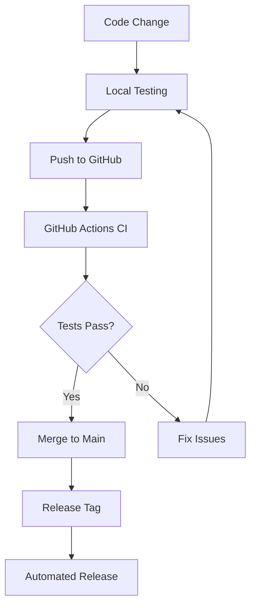
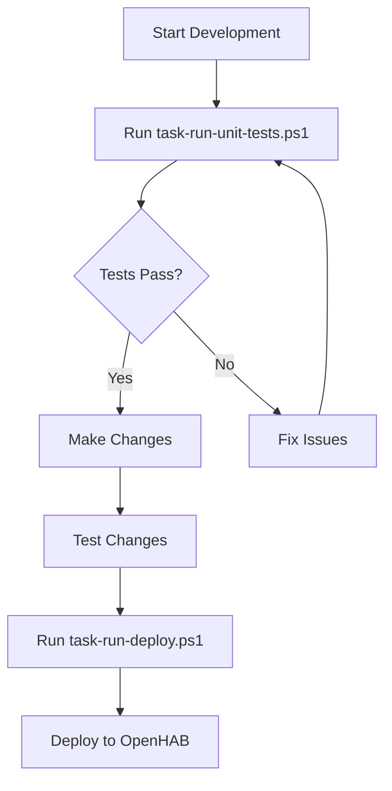

# CI/CD and Automation Guide

Comprehensive guide to the automated testing, building, and deployment systems for the Sonoff Binding Smart'nyDom Enhanced Edition.

## 🎯 Overview

The project features a complete CI/CD pipeline with:
- **Automated testing** on every code change
- **Quality gates** preventing broken code deployment
- **Cross-platform compatibility** verification
- **Automated releases** with professional artifacts
- **Local development scripts** mirroring CI/CD processes

## 🔄 GitHub Actions Workflows

### CI/CD Pipeline (`ci.yml`)

#### Triggers
- **Push** to main, master, or develop branches
- **Pull requests** to main or master
- **Manual dispatch** via GitHub UI

#### Workflow Jobs

##### 1. Code Quality Checks
```yaml
- Spotless formatting validation
- Maven POM validation
- Runs on Ubuntu with JDK 17
```

**Purpose:** Ensure code meets OpenHAB standards before testing

##### 2. Unit Tests (Matrix Strategy)
```yaml
strategy:
  matrix:
    java: [17, 21]
```

**Features:**
- Tests on multiple Java versions
- Comprehensive test suite execution (100+ methods)
- Detailed test reports with JUnit XML
- Artifact upload for test results
- Fail-fast disabled for complete coverage

##### 3. Component-Specific Tests
```yaml
strategy:
  matrix:
    component: 
      - "SonoffCacheProvider*"
      - "SonoffHandlerFactory*" 
      - "SonoffDiscoveryService*"
```

**Benefits:**
- Parallel execution for faster feedback
- Component isolation for debugging
- Individual component status tracking
- Targeted test artifact collection

##### 4. Integration Tests
```yaml
- Integration test suite (*IntegrationTest)
- Error handling tests (*ErrorHandlingTest)
- Real-world scenario validation
```

**Coverage:**
- File system operations
- Concurrent access patterns
- Performance validation
- Resource cleanup verification

##### 5. Build Verification
```yaml
- Code formatting application
- JAR compilation and packaging
- Artifact verification and upload
- Build integrity validation
```

**Quality Assurance:**
- Ensures deployable artifacts
- Validates packaging process
- Provides downloadable JARs
- Verifies build reproducibility

##### 6. Cross-Platform Tests
```yaml
strategy:
  matrix:
    os: [ubuntu-latest, windows-latest, macos-latest]
```

**Validation:**
- Core functionality across platforms
- Java compatibility verification
- Platform-specific behavior testing
- Environment consistency checks

##### 7. Test Summary
```yaml
- Comprehensive results aggregation
- Status reporting and visualization
- Coverage statistics display
- Overall pipeline status determination
```

### Release Pipeline (`release.yml`)

#### Triggers
- **Git tags** starting with 'v' (e.g., v1.0.0, v2.1.3)
- **Manual workflow dispatch** with version input

#### Release Jobs

##### 1. Pre-Release Tests
**Equivalent to:** `task-run-unit-tests.ps1`

```yaml
Steps:
- Code formatting with Spotless
- Comprehensive test suite execution
- Build integrity verification
- Quality gate enforcement
```

**Quality Gates:**
- All tests must pass
- Code formatting must be valid
- Build must succeed
- No compilation errors

##### 2. Create Release
**Equivalent to:** `task-run-deploy.ps1`

```yaml
Steps:
- Apply code formatting
- Run tests as quality gate
- Build release JAR
- Create GitHub release
- Upload JAR artifact
- Generate release notes
```

**Artifacts:**
- Professional JAR naming: `org.openhab.binding.sonoff-{version}-SmartnyDom.jar`
- Comprehensive release notes
- Direct download links
- Version-specific documentation

##### 3. Post-Release Tasks
```yaml
- Release summary generation
- Documentation link updates
- Success confirmation
- Notification preparation
```

## 🖥️ Local Development Scripts

### Enhanced PowerShell Scripts

#### task-run-unit-tests.ps1 (115 lines)

**Features:**
- **4-step progress tracking** with colored output
- **Timing measurements** for Spotless and test execution
- **Comprehensive error handling** with troubleshooting guidance
- **Success/failure summaries** with execution times
- **Next steps guidance** for both scenarios

**Workflow:**
```powershell
[STEP 1/4] Navigating to project directory...
[STEP 2/4] Clearing console for clean output...
[STEP 3/4] Applying code formatting with Spotless...
[STEP 4/4] Running unit tests...
```

**Error Handling:**
- Directory validation with clear error messages
- Spotless failure troubleshooting
- Test failure analysis and guidance
- Performance timing for optimization

#### task-run-deploy.ps1 (267 lines)

**Features:**
- **7-step CI/CD workflow** with quality gates
- **Unit test execution** as mandatory step 4
- **Deployment abortion** if any tests fail
- **JAR file validation** and deployment verification
- **OpenHAB log clearing** for clean monitoring

**Workflow:**
```powershell
[STEP 1/7] Navigating to project directory...
[STEP 2/7] Clearing console for clean output...
[STEP 3/7] Applying code formatting with Spotless...
[STEP 4/7] Running unit tests...           # Quality Gate
[STEP 5/7] Compiling Sonoff binding...
[STEP 6/7] Deploying JAR to OpenHAB...
[STEP 7/7] Clearing OpenHAB log file...
```

**Quality Gates:**
- Code formatting must pass
- All unit tests must pass before deployment
- Compilation must succeed
- JAR deployment must be verified

## 🎯 Quality Assurance Features

### Automated Quality Gates

#### Code Quality
```yaml
- Spotless formatting enforcement
- Maven POM validation
- Compilation error prevention
- Dependency conflict detection
```

#### Test Quality
```yaml
- 100+ test methods execution
- Mock-based unit testing
- Integration test validation
- Error handling verification
- Cross-platform compatibility
```

#### Build Quality
```yaml
- JAR creation verification
- Artifact integrity validation
- Deployment readiness confirmation
- Version consistency checks
```

### Comprehensive Test Coverage

#### Test Categories
- **Unit Tests:** 50+ methods for core functionality
- **Integration Tests:** 30+ methods for real-world scenarios
- **Error Handling Tests:** 20+ methods for edge cases
- **Discovery Tests:** Component-specific functionality

#### Testing Technologies
- **JUnit 5 (Jupiter)** - Modern testing framework
- **Mockito 5.8.0** - Mock object framework
- **Maven Surefire Plugin** - Test execution and reporting
- **Spotless** - Code formatting enforcement

## 🔧 Configuration and Customization

### GitHub Actions Configuration

#### Environment Variables
```yaml
env:
  MAVEN_OPTS: -Xmx1024m
```

#### Cache Configuration
```yaml
- name: Cache Maven dependencies
  uses: actions/cache@v3
  with:
    path: ~/.m2
    key: ${{ runner.os }}-m2-${{ hashFiles('**/pom.xml') }}
    restore-keys: ${{ runner.os }}-m2
```

#### Artifact Management
```yaml
- name: Upload test results
  uses: actions/upload-artifact@v3
  with:
    name: test-results-jdk${{ matrix.java }}
    path: |
      target/surefire-reports/
      target/site/jacoco/
    retention-days: 30
```

### PowerShell Script Configuration

#### Project Path Configuration
```powershell
$projectPath = "D:\Adrian\Projekty\openhab\openhab-addons\bundles\org.openhab.binding.sonoff"
$jarSourcePath = "...\target\org.openhab.binding.sonoff-5.0.2-SNAPSHOT.jar"
$jarDestPath = "O:\configuration\addons\org.openhab.binding.sonoff-5.0.2-SmartnyDom-v0.x.jar"
$logPath = "O:\configuration\logs\openhab.log"
```

#### Timing and Progress Tracking
```powershell
$spotlessStart = Get-Date
mvn spotless:apply
$spotlessResult = $LASTEXITCODE
$spotlessEnd = Get-Date
$spotlessDuration = ($spotlessEnd - $spotlessStart).TotalSeconds
```

## 📊 Monitoring and Reporting

### GitHub Actions Reporting

#### Test Reports
- **JUnit XML reports** for detailed test results
- **Test summary visualization** in GitHub UI
- **Failure analysis** with stack traces
- **Performance metrics** and timing data

#### Build Artifacts
- **JAR files** with version-specific naming
- **Test reports** for offline analysis
- **Coverage reports** (when configured)
- **Build logs** for troubleshooting

#### Status Badges
```markdown
[](https://github.com/tschaban/openhab-addons-sonoff/actions/workflows/ci.yml)
[](https://github.com/tschaban/openhab-addons-sonoff/actions/workflows/release.yml)
```

### Local Script Reporting

#### PowerShell Output
```powershell
Write-Host "[OK] Code formatting completed successfully" -ForegroundColor Green
Write-Host "Duration: $([math]::Round($spotlessDuration, 2)) seconds" -ForegroundColor Gray
```

#### Execution Summary
```powershell
Write-Host "Execution Summary:" -ForegroundColor Cyan
Write-Host "  Code formatting: $([math]::Round($spotlessDuration, 2)) seconds" -ForegroundColor Gray
Write-Host "  Unit tests: $([math]::Round($testDuration, 2)) seconds" -ForegroundColor Gray
Write-Host "  Compilation: $([math]::Round($compileDuration, 2)) seconds" -ForegroundColor Gray
Write-Host "  Total time: $([math]::Round($spotlessDuration + $testDuration + $compileDuration, 2)) seconds" -ForegroundColor Gray
```

## 🚀 Advanced Features

### Parallel Execution
- **Component tests** run in parallel for faster feedback
- **Cross-platform tests** execute simultaneously
- **Matrix strategies** for comprehensive coverage
- **Fail-fast disabled** for complete test visibility

### Artifact Management
- **Retention policies** for storage optimization
- **Version-specific naming** for clarity
- **Professional packaging** for releases
- **Download optimization** with compression

### Error Handling
- **Comprehensive error messages** with troubleshooting steps
- **Execution timing** for performance monitoring
- **Detailed logging** for debugging
- **Recovery suggestions** for common issues

## 🔄 Workflow Integration

### Development Workflow


### Local Development


## 🛠️ Troubleshooting

### Common CI/CD Issues

#### GitHub Actions Failures
```yaml
# Check workflow logs
- Navigate to Actions tab
- Select failed workflow
- Review job logs
- Check artifact uploads
```

#### PowerShell Script Issues
```powershell
# Execution policy
Set-ExecutionPolicy -ExecutionPolicy RemoteSigned -Scope CurrentUser

# Path verification
$env:PATH -split ';' | Where-Object { $_ -like '*java*' -or $_ -like '*maven*' }

# Permission issues
Start-Process PowerShell -Verb RunAs
```

### Performance Optimization

#### GitHub Actions
- **Cache Maven dependencies** for faster builds
- **Parallel job execution** for reduced wait times
- **Artifact optimization** for storage efficiency
- **Matrix strategy tuning** for optimal coverage

#### Local Scripts
- **Maven offline mode** when dependencies are cached
- **Selective test execution** during development
- **IDE integration** for faster feedback
- **Incremental compilation** for efficiency

## 📈 Future Enhancements

### Planned Features
- **Code coverage reporting** with Jacoco integration
- **Performance benchmarking** for regression detection
- **Security scanning** with dependency analysis
- **Documentation generation** from code comments

### Integration Opportunities
- **Slack/Discord notifications** for team awareness
- **JIRA integration** for issue tracking
- **SonarQube analysis** for code quality metrics
- **Docker containerization** for consistent environments

This comprehensive CI/CD system ensures code quality, automates tedious tasks, and provides professional development experience for the Sonoff Binding Smart'nyDom Enhanced Edition.