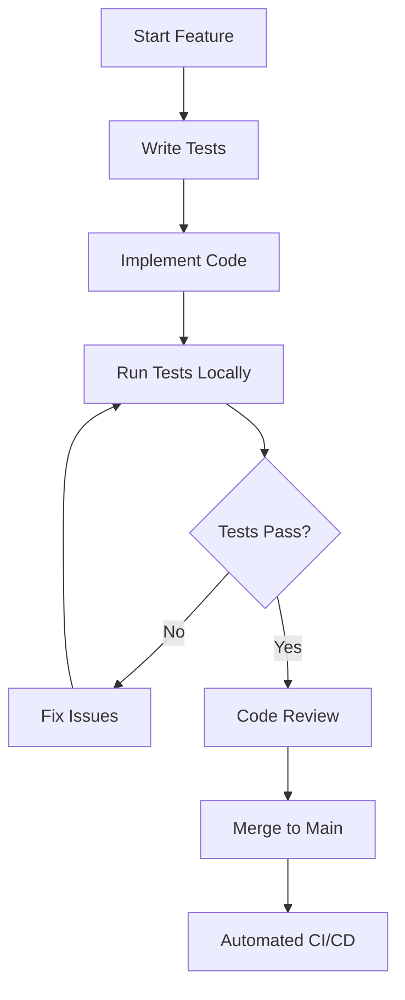

# Developer Workflow and Best Practices

Comprehensive guide to professional development practices, workflows, and quality standards for the Sonoff Binding Smart'nyDom Enhanced Edition.

## 🎯 Development Philosophy

The Smart'nyDom Enhanced Edition follows these core principles:
- **Quality First** - Comprehensive testing before deployment
- **Automation** - Reduce manual tasks through scripts and CI/CD
- **Professional Standards** - Enterprise-grade development practices
- **Community Focus** - Clear documentation and contribution guidelines

## 🔄 Development Workflow

### 1. Setup and Initialization

#### Initial Environment Setup
```bash
# Clone the repository
git clone https://github.com/tschaban/openhab-addons-sonoff.git
cd openhab-addons-sonoff

# Verify environment
java -version    # Should be 17+
mvn -version     # Should be 3.6+
git --version    # Any recent version

# Run initial test to verify setup
.\task-run-unit-tests.ps1
```

#### IDE Configuration
**Recommended IDEs:**
- **Visual Studio Code** with Java Extension Pack
- **IntelliJ IDEA** Community or Ultimate
- **Eclipse** with Maven and Git plugins

**Essential IDE Settings:**
- **Code formatting** - Import OpenHAB code style
- **Maven integration** - Auto-import dependencies
- **Git integration** - For version control
- **Test runners** - JUnit 5 support

### 2. Feature Development Cycle

#### Branch Strategy
```bash
# Create feature branch from main
git checkout main
git pull origin main
git checkout -b feature/device-support-t5-4c

# Work on feature
# ... make changes ...

# Test frequently during development
.\task-run-unit-tests.ps1

# Commit with meaningful messages
git add .
git commit -m "feat: add support for SONOFF T5-4C switch

- Add device UUID mapping
- Implement channel configuration
- Add comprehensive unit tests
- Update device discovery logic"

# Push feature branch
git push origin feature/device-support-t5-4c
```

#### Development Loop


### 3. Testing Strategy

#### Test-Driven Development (TDD)
```java
// 1. Write failing test first
@Test
@DisplayName("Should support T5-4C device configuration")
void testT54CDeviceSupport() {
    // Arrange
    String deviceId = "1000abc123";
    String deviceType = "T5-4C";
    
    // Act
    DeviceConfig config = deviceFactory.createConfig(deviceId, deviceType);
    
    // Assert
    assertNotNull(config);
    assertEquals(4, config.getChannelCount());
    assertTrue(config.supportsLocalMode());
}

// 2. Implement minimal code to pass
// 3. Refactor and improve
// 4. Repeat for next feature
```

#### Testing Hierarchy
```
Unit Tests (Fast, Isolated)
├── SonoffCacheProviderTest.java (436 lines)
├── SonoffHandlerFactoryTest.java (481 lines)
└── SonoffDiscoveryServiceTest.java

Integration Tests (Real Dependencies)
├── SonoffCacheProviderIntegrationTest.java (413 lines)
├── SonoffHandlerFactoryIntegrationTest.java (300 lines)
└── End-to-end device testing

Error Handling Tests (Edge Cases)
└── SonoffCacheProviderErrorHandlingTest.java (396 lines)
```

#### Test Execution Strategy
```powershell
# During development - fast feedback
mvn test -Dtest="*Test" -DfailIfNoTests=false

# Component-specific testing
mvn test -Dtest="SonoffCacheProvider*"

# Full test suite before commit
.\task-run-unit-tests.ps1

# Integration testing before deployment
.\task-run-deploy.ps1
```

### 4. Code Quality Standards

#### Code Formatting
```bash
# Automatic formatting (integrated in scripts)
mvn spotless:apply

# Check formatting without fixing
mvn spotless:check
```

**Spotless Configuration:**
- **OpenHAB code style** enforcement
- **Import organization** and cleanup
- **Line ending normalization**
- **Trailing whitespace removal**

#### Code Review Checklist
- ✅ **Tests written** for new functionality
- ✅ **Code formatted** with Spotless
- ✅ **Documentation updated** if needed
- ✅ **Error handling** implemented
- ✅ **Performance considered** for new features
- ✅ **Backward compatibility** maintained

#### Commit Message Standards
```bash
# Format: type(scope): description
feat(discovery): add support for T5-4C switches
fix(cache): resolve concurrent access issue
docs(readme): update device compatibility list
test(factory): add error handling test cases
refactor(handler): improve channel initialization
```

**Types:**
- `feat` - New features
- `fix` - Bug fixes
- `docs` - Documentation changes
- `test` - Test additions/modifications
- `refactor` - Code restructuring
- `perf` - Performance improvements
- `chore` - Maintenance tasks

## 🧪 Testing Best Practices

### Unit Testing Guidelines

#### Test Structure (AAA Pattern)
```java
@Test
@DisplayName("Should create cache file with valid JSON content")
void testCacheFileCreation() {
    // Arrange
    String deviceId = "test123";
    Map<String, Object> deviceData = createTestDeviceData();
    
    // Act
    boolean result = cacheProvider.newFile(deviceId, deviceData);
    
    // Assert
    assertTrue(result);
    assertTrue(cacheProvider.checkFile(deviceId));
    
    // Verify file content
    String content = cacheProvider.getFile(deviceId);
    assertNotNull(content);
    assertTrue(content.contains("\"deviceId\":\"test123\""));
}
```

#### Mock Usage with Mockito
```java
@ExtendWith(MockitoExtension.class)
class SonoffHandlerFactoryTest {
    
    @Mock
    private BundleContext bundleContext;
    
    @Mock
    private ComponentContext componentContext;
    
    @InjectMocks
    private SonoffHandlerFactory handlerFactory;
    
    @Test
    void testHandlerCreation() {
        // Arrange
        when(bundleContext.getProperty(anyString())).thenReturn("test-value");
        
        // Act
        ThingHandler handler = handlerFactory.createHandler(thing);
        
        // Assert
        assertNotNull(handler);
        verify(bundleContext).getProperty("openhab.userdata");
    }
}
```

#### Test Data Management
```java
// Use test builders for complex objects
public class DeviceDataBuilder {
    private String deviceId = "default123";
    private String deviceType = "BASIC";
    private boolean online = true;
    
    public DeviceDataBuilder withDeviceId(String deviceId) {
        this.deviceId = deviceId;
        return this;
    }
    
    public DeviceDataBuilder withDeviceType(String deviceType) {
        this.deviceType = deviceType;
        return this;
    }
    
    public Map<String, Object> build() {
        Map<String, Object> data = new HashMap<>();
        data.put("deviceid", deviceId);
        data.put("uiid", getUiidForType(deviceType));
        data.put("online", online);
        return data;
    }
}

// Usage in tests
@Test
void testDeviceWithCustomConfiguration() {
    Map<String, Object> deviceData = new DeviceDataBuilder()
        .withDeviceId("custom123")
        .withDeviceType("T5-4C")
        .build();
    
    // Test with custom data
}
```

### Integration Testing

#### File System Testing
```java
@Test
void testRealFileOperations() {
    // Use temporary directories for integration tests
    Path tempDir = Files.createTempDirectory("sonoff-test");
    SonoffCacheProvider provider = new SonoffCacheProvider(tempDir.toString());
    
    try {
        // Test real file operations
        assertTrue(provider.newFile("test", testData));
        assertTrue(Files.exists(tempDir.resolve("test.json")));
    } finally {
        // Cleanup
        Files.walk(tempDir)
            .sorted(Comparator.reverseOrder())
            .map(Path::toFile)
            .forEach(File::delete);
    }
}
```

#### Concurrent Testing
```java
@Test
void testConcurrentAccess() throws InterruptedException {
    int threadCount = 10;
    CountDownLatch latch = new CountDownLatch(threadCount);
    List<Future<Boolean>> futures = new ArrayList<>();
    
    ExecutorService executor = Executors.newFixedThreadPool(threadCount);
    
    for (int i = 0; i < threadCount; i++) {
        final int threadId = i;
        Future<Boolean> future = executor.submit(() -> {
            try {
                return cacheProvider.newFile("device" + threadId, testData);
            } finally {
                latch.countDown();
            }
        });
        futures.add(future);
    }
    
    latch.await(10, TimeUnit.SECONDS);
    
    // Verify all operations succeeded
    for (Future<Boolean> future : futures) {
        assertTrue(future.get());
    }
    
    executor.shutdown();
}
```

## 🔧 Development Tools and Scripts

### PowerShell Scripts Usage

#### Daily Development
```powershell
# Start development session
.\task-run-unit-tests.ps1

# Make changes, then test again
.\task-run-unit-tests.ps1

# When ready to deploy
.\task-run-deploy.ps1
```

#### Continuous Testing
```powershell
# Watch for file changes and run tests (PowerShell 7+)
while ($true) {
    $lastWrite = (Get-ChildItem -Recurse src/ -Include *.java | 
                  Sort-Object LastWriteTime -Descending | 
                  Select-Object -First 1).LastWriteTime
    
    if ($lastWrite -gt $lastTestRun) {
        Write-Host "Changes detected, running tests..." -ForegroundColor Yellow
        .\task-run-unit-tests.ps1
        $lastTestRun = Get-Date
    }
    
    Start-Sleep -Seconds 5
}
```

### IDE Integration

#### Visual Studio Code
```json
// .vscode/tasks.json
{
    "version": "2.0.0",
    "tasks": [
        {
            "label": "Run Unit Tests",
            "type": "shell",
            "command": "powershell",
            "args": ["-File", "task-run-unit-tests.ps1"],
            "group": "test",
            "presentation": {
                "echo": true,
                "reveal": "always",
                "focus": false,
                "panel": "new"
            }
        },
        {
            "label": "Deploy to OpenHAB",
            "type": "shell",
            "command": "powershell",
            "args": ["-File", "task-run-deploy.ps1"],
            "group": "build",
            "presentation": {
                "echo": true,
                "reveal": "always",
                "focus": false,
                "panel": "new"
            }
        }
    ]
}
```

#### IntelliJ IDEA
```xml
<!-- Add as External Tool -->
<tool name="Run Unit Tests"
      description="Run comprehensive unit test suite"
      showInMainMenu="true"
      showInEditor="true"
      showInProject="true"
      showInSearchPopup="true"
      disabled="false"
      useConsole="true"
      showConsoleOnStdOut="true"
      showConsoleOnStdErr="true"
      synchronizeAfterRun="true">
  <exec>
    <option name="COMMAND" value="powershell" />
    <option name="PARAMETERS" value="-File task-run-unit-tests.ps1" />
    <option name="WORKING_DIRECTORY" value="$ProjectFileDir$" />
  </exec>
</tool>
```

## 🚀 CI/CD Integration

### Local Development Mirrors CI/CD
```powershell
# Local equivalent of GitHub Actions CI
.\task-run-unit-tests.ps1    # Mirrors CI pipeline testing

# Local equivalent of GitHub Actions Release
.\task-run-deploy.ps1        # Mirrors release pipeline
```

### Pre-Commit Hooks
```bash
#!/bin/sh
# .git/hooks/pre-commit

echo "Running pre-commit tests..."
powershell -File task-run-unit-tests.ps1

if [ $? -ne 0 ]; then
    echo "Tests failed. Commit aborted."
    exit 1
fi

echo "All tests passed. Proceeding with commit."
```

### Branch Protection Rules
**Recommended GitHub settings:**
- ✅ **Require pull request reviews** before merging
- ✅ **Require status checks** to pass before merging
- ✅ **Require branches to be up to date** before merging
- ✅ **Include administrators** in restrictions

## 📊 Performance and Quality Metrics

### Code Quality Metrics
- **Test Coverage** - Aim for >80% line coverage
- **Test Count** - Currently 100+ test methods
- **Code Complexity** - Keep methods simple and focused
- **Documentation** - Document complex business logic

### Performance Benchmarks
```java
@Test
@Timeout(value = 5, unit = TimeUnit.SECONDS)
void testPerformanceRequirement() {
    // Test must complete within 5 seconds
    long startTime = System.currentTimeMillis();
    
    // Perform operation
    cacheProvider.processLargeDataSet(largeDataSet);
    
    long duration = System.currentTimeMillis() - startTime;
    assertTrue(duration < 3000, "Operation took too long: " + duration + "ms");
}
```

### Quality Gates
1. **Code Formatting** - Must pass Spotless checks
2. **Unit Tests** - All tests must pass
3. **Integration Tests** - Real-world scenarios validated
4. **Build Success** - JAR must compile without errors
5. **Deployment Verification** - Successful OpenHAB deployment

## 🛠️ Troubleshooting and Debugging

### Common Development Issues

#### Test Failures
```bash
# Run specific failing test with debug info
mvn test -Dtest="FailingTestClass#failingMethod" -X

# Run tests with JVM debugging
mvn test -Dmaven.surefire.debug

# Generate detailed test reports
mvn test -Dsurefire.useFile=false
```

#### Build Issues
```bash
# Clean and rebuild
mvn clean compile

# Dependency analysis
mvn dependency:tree
mvn dependency:analyze

# Verify Maven configuration
mvn help:effective-pom
```

#### OpenHAB Integration Issues
```bash
# Check OpenHAB logs
tail -f /path/to/openhab/logs/openhab.log

# Verify JAR deployment
ls -la /path/to/openhab/addons/

# Check binding status in OpenHAB console
bundle:list | grep sonoff
```

### Debugging Techniques

#### Unit Test Debugging
```java
@Test
void debugTest() {
    // Add detailed logging
    logger.debug("Testing with deviceId: {}", deviceId);
    
    // Use assertions with custom messages
    assertTrue(result, "Expected result to be true for deviceId: " + deviceId);
    
    // Print intermediate values
    System.out.println("Intermediate result: " + intermediateValue);
}
```

#### Integration Debugging
```java
@Test
void debugIntegration() {
    // Enable detailed logging
    System.setProperty("org.slf4j.simpleLogger.defaultLogLevel", "DEBUG");
    
    // Add breakpoints in IDE
    // Use step-through debugging
    
    // Verify file system state
    Files.list(tempDirectory).forEach(System.out::println);
}
```

## 📚 Documentation Standards

### Code Documentation
```java
/**
 * Creates a new cache file for the specified device.
 * 
 * This method handles the creation of JSON cache files that store
 * device state and configuration information. The cache is used
 * to maintain device state between OpenHAB restarts and to provide
 * faster access to device information.
 * 
 * @param deviceId the unique identifier for the device
 * @param deviceData the device state and configuration data
 * @return true if the file was created successfully, false otherwise
 * @throws IllegalArgumentException if deviceId is null or empty
 * @throws IOException if file creation fails due to I/O errors
 * 
 * @since 1.0.0
 */
public boolean newFile(String deviceId, Map<String, Object> deviceData) {
    // Implementation
}
```

### Test Documentation
```java
/**
 * Test suite for SonoffCacheProvider file operations.
 * 
 * This test class validates the core functionality of the cache provider,
 * including file creation, reading, and management operations. Tests use
 * temporary directories to avoid affecting the actual cache.
 * 
 * @author Smart'nyDom
 * @since 1.0.0
 */
@DisplayName("SonoffCacheProvider File Operations")
class SonoffCacheProviderTest {
    
    @Test
    @DisplayName("Should create cache file with valid JSON content")
    void testCacheFileCreation() {
        // Test implementation
    }
}
```

## 🎯 Contribution Guidelines

### For New Contributors
1. **Read this guide** thoroughly
2. **Set up development environment** following setup guide
3. **Run existing tests** to verify setup
4. **Start with small changes** to understand the codebase
5. **Follow testing practices** for all new code

### For Feature Development
1. **Create feature branch** from main
2. **Write tests first** (TDD approach)
3. **Implement functionality** to pass tests
4. **Run full test suite** before committing
5. **Create pull request** with detailed description

### For Bug Fixes
1. **Reproduce the bug** with a failing test
2. **Fix the issue** while keeping test passing
3. **Verify fix** doesn't break existing functionality
4. **Add regression test** to prevent future occurrences

## 🚀 Advanced Development Techniques

### Custom Test Categories
```java
// Create custom test annotations
@Target(ElementType.METHOD)
@Retention(RetentionPolicy.RUNTIME)
@Tag("performance")
public @interface PerformanceTest {
}

@Target(ElementType.METHOD)
@Retention(RetentionPolicy.RUNTIME)
@Tag("integration")
public @interface IntegrationTest {
}

// Use in tests
@Test
@PerformanceTest
void testCachePerformance() {
    // Performance-specific test
}

// Run specific categories
mvn test -Dgroups="performance"
mvn test -Dgroups="integration"
```

### Test Data Factories
```java
public class TestDataFactory {
    public static Map<String, Object> createBasicDevice() {
        return createDevice("basic", "BASIC", true);
    }
    
    public static Map<String, Object> createPowDevice() {
        return createDevice("pow", "POW", true);
    }
    
    public static Map<String, Object> createOfflineDevice() {
        return createDevice("offline", "BASIC", false);
    }
    
    private static Map<String, Object> createDevice(String id, String type, boolean online) {
        Map<String, Object> device = new HashMap<>();
        device.put("deviceid", id);
        device.put("uiid", getUiidForType(type));
        device.put("online", online);
        device.put("params", createDefaultParams());
        return device;
    }
}
```

This comprehensive guide provides everything needed for professional development of the Sonoff Binding Smart'nyDom Enhanced Edition, ensuring code quality, maintainability, and team collaboration.